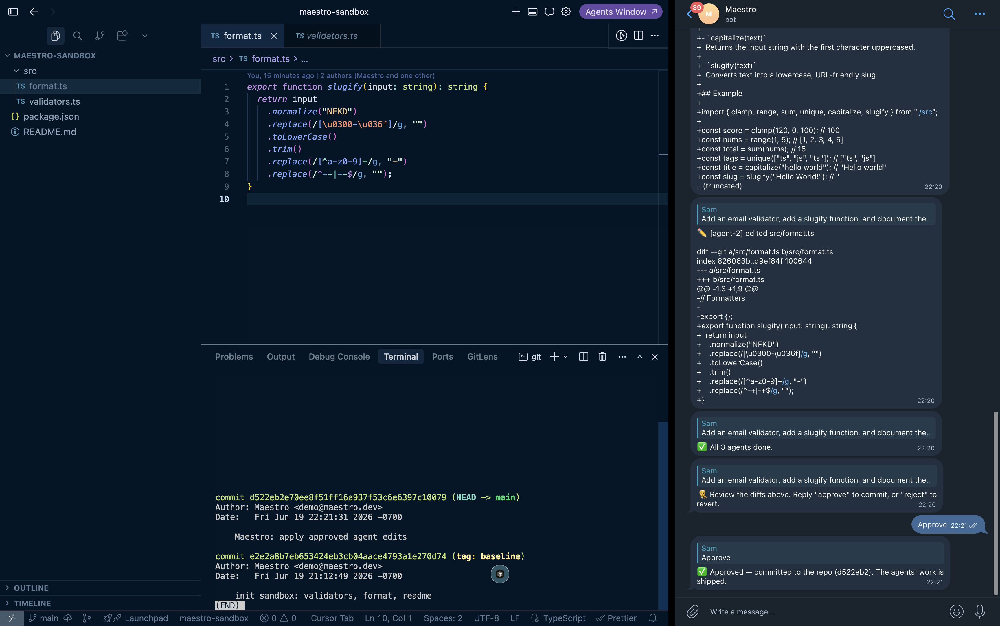
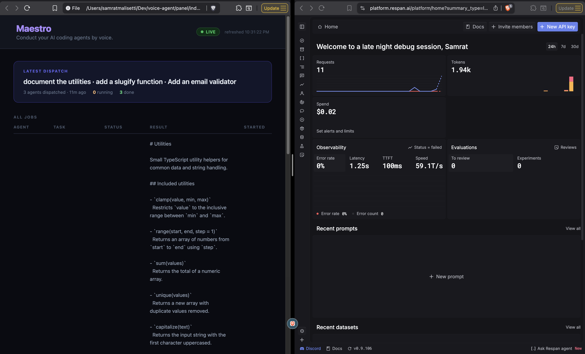

# Maestro 🎼

**Run a fleet of AI coding agents by voice. They edit real code in parallel and report back in your chat — you approve or reject with a word.**

Built at the Voice Coding Mini-Hackathon with **Voice Cursor · Convex · Respan · Photon**.

---

## See it in action



*Speak one command → three agents edit real files in parallel (Cursor, left) → each sends its diff to your chat (Telegram, right) → you reply **approve** → it's committed to git (terminal). Reply **reject** and it reverts to a clean baseline.*



*The live board (left) shows every agent running → done in real time. Respan (right) traces every model call — here: 11 requests, $0.02 spend, 0% errors, fully auditable.*

---

## The problem

AI coding agents are powerful, but using them keeps you chained to your desk. You start one and wait. It stops to ask permission and gets stuck if you've stepped away. Run several at once and it's chaos — and you can't really trust code an agent wrote while you weren't looking.

## What Maestro does

You **speak one command**. Maestro splits it into separate tasks and runs an **agent on each one in parallel** — each editing a different file, so there are no conflicts. The agents send you their **actual code changes (git diffs)** in your messaging app. You reply **`approve`** to commit them or **`reject`** to revert to a clean baseline — a real **human-in-the-loop**. A **live board** shows every agent's status in real time, and every model call is **routed and traced** so you can see exactly what each agent did.

> Voice in → a fleet of agents → real code edits → diffs in your chat → you decide → committed → fully auditable.

## How it works

```
Voice (Voice Cursor)
   │  dictate a command into Telegram
   ▼
Photon / Spectrum  ──►  runner.ts  ──►  Convex: dispatch()
                          (bridge)         │  splits command, fans out
                          ▲                ▼
                          │         processJob ×N (parallel)
                          │           LLM via Respan (traced)
                          │                │
   diffs + approve/reject │         writes real files in a repo
   ◄──────────────────────┘                │
                                    live Board (Convex reactive)
```

- **Voice Cursor** — voice input; the whole flow is hands-free.
- **Convex** — reactive backend: agent state, parallel fan-out (scheduler), live status board.
- **Respan** — AI gateway + observability; every agent call is routed and traced for trust.
- **Photon (Spectrum)** — brings the agents into your chat (Telegram / iMessage), reaching you where you already are.

## Run it

```bash
npm install
npx convex dev                     # local reactive backend

# Convex backend env (the agents read these):
npx convex env set MOCK_MODE false
npx convex env set RESPAN_BASE_URL https://api.respan.ai/api
npx convex env set RESPAN_MODEL <model>
npx convex env set RESPAN_API_KEY <key>

# .env (the runner reads these):
#   CONVEX_URL=...           REAL_EDITS=true   REPO_PATH=/path/to/target/repo
#   CHANNEL=telegram         PHOTON_PROJECT_ID=...   PHOTON_PROJECT_SECRET=...
#   TELEGRAM_BOT_TOKEN=...   (from @BotFather)

npx tsx runner.ts                  # start the agent runner
open panel/index.html              # the live board
```

`MOCK_MODE=true` runs the whole pipeline with canned output (no credits needed). Channels: `terminal` (no creds), `telegram`, or `imessage`.

## Project layout

| Path | Role |
|---|---|
| `convex/agent.ts` | `dispatch` (fan-out) + `processJob` (runs each agent via Respan) |
| `convex/jobs.ts` · `convex/schema.ts` | job state + reactive queries |
| `runner.ts` | Spectrum bridge: messaging ⇄ Convex, applies real edits, approve/reject |
| `panel/index.html` | live agent board |

Built with TypeScript.
